# 🦈 UniShark - Your Ultimate Academic Assistant

**🎓 Never miss a deadline again! UniShark automatically monitors your university portal and keeps you informed.**

---

## 🌟 What is UniShark?

UniShark is an intelligent academic monitoring system that automatically tracks your university assignments, deadlines, absences, and course registrations. Built specifically for Example university learning system, it provides real-time notifications across multiple platforms to ensure you never miss important academic updates.

### 🎯 Key Features

🤖 <strong>Automated Monitoring</strong>

- **Smart Scraping**: Automatically logs into your university portal
- **Real-time Updates**: Monitors changes every few hours (customizable)
- **Intelligent Detection**: Identifies new assignments, deadlines, and absences
- **Background Processing**: Runs silently using Celery task queues

🔔 <strong>Multi-Platform Notifications</strong>

- **Discord Webhooks**: Rich embedded notifications with assignment details
- **Telegram Bot**: Instant messages with markdown formatting
- **Email Alerts**: Professional HTML emails via Brevo
- **Customizable Timing**: Set how many hours before deadlines to notify

🛡️ <strong>Advanced Security</strong>

- **CAPTCHA Bypass**: Integrates with NopeCHA and FreeCaptchaBypass APIs
- **Secure Authentication**: Uses Clerk for user management
- **Encrypted Storage**: User credentials stored securely in Supabase
- **Rate Limiting**: Prevents detection

📊 <strong>Comprehensive Dashboard</strong>

- **Assignment Tracking**: View all assignments with status and deadlines
- **Absence Monitoring**: Track attendance records
- **Course Registration**: Monitor available courses and registration periods
- **Statistics**: Detailed analytics of your academic performance

---

## 🏗️ Architecture Overview

```mermaid
graph TB
    A[🌐 Next.js Frontend] --> B[🔐 Clerk Authentication]
    A --> C[⚡ FastAPI Backend]
    C --> D[🗄️ Supabase Database]
    C --> E[🔴 Redis Queue]
    E --> F[⚙️ Celery Workers]
    F --> G[🕷️ Web Scraper]
    G --> H[🎓 University Portal]
    F --> I[🔔 Notification Service]
    I --> J[💬 Discord]
    I --> K[📱 Telegram]
    I --> L[📧 Email]
    G --> M[🤖 CAPTCHA Bypass]
    M --> N[🔓 NopeCHA API]
    M --> O[🔓 FreeCaptchaBypass API]
```

### 🛠️ Tech Stack

#### Frontend
- **Next.js 14** - React framework with App Router
- **TypeScript** - Type-safe development
- **Tailwind CSS** - Utility-first styling
- **Clerk** - Authentication and user management
- **React Query** - Server state management

#### Backend
- **FastAPI** - High-performance Python API framework
- **Celery** - Distributed task queue
- **Redis** - Message broker and caching
- **Supabase** - PostgreSQL database with real-time features
- **Selenium** - Browser automation

#### Infrastructure
- **Heroku** - Cloud platform deployment
- **Docker** - Containerization

---

## 📊 Usage Analytics

UniShark provides detailed analytics:

- **Assignment Completion Rate**: Track your productivity
- **Deadline Adherence**: Monitor how often you meet deadlines
- **Attendance Patterns**: Analyze your class attendance
- **Course Performance**: Compare performance across subjects

---

## 🛡️ Privacy & Security

### Data Protection
- All user credentials are encrypted before storage
- No passwords are stored in plain text
- Regular security audits and updates
- GDPR compliant data handling

### University Portal Safety
- Respectful scraping with delays
- User-agent rotation to avoid detection
- Rate limiting to prevent overload
- Graceful error handling

---

## 📄 License

**Proprietary License - All Rights Reserved**

This software is proprietary and confidential. Unauthorized copying, distribution, or modification is strictly prohibited.

### Educational Use Only
This project is intended for educational purposes only. Users are responsible for complying with their university's terms of service and applicable laws.

For inquiries or concerns, contact: admin@unishark.site

---

## 📈 Roadmap

### Upcoming Features
- 🔄 **Multi-University Support**: Expand beyond 
- 📝 **Customizable Notifications**: Personalized alerts
- 📊 **Detailed Analytics**: Track academic performance and Attendance Patterns
- 🤖 **AI Assistant**: Smart recommendations and study planning
- 🔗 **Calendar Integration**: Sync with Google Calendar, Outlook
- 👥 **Study Groups**: Collaborative features for students

### Version History
- **v2.0.0** (Current) - Multi-platform notifications, enhanced UI
- **v1.5.0** - CAPTCHA bypass integration
- **v1.0.0** - Initial release with basic scraping and notifications

---

**Made with ❤️ for students, by students**

🦈 **UniShark** - Swimming through academia, one deadline at a time!

[⭐ Star this repo](https://github.com/a1harfoush/Uni-Shark)

